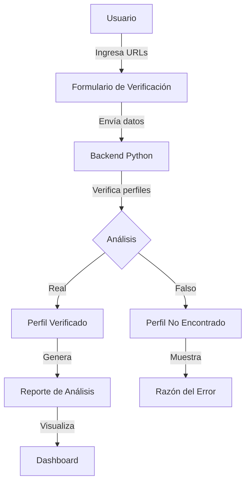
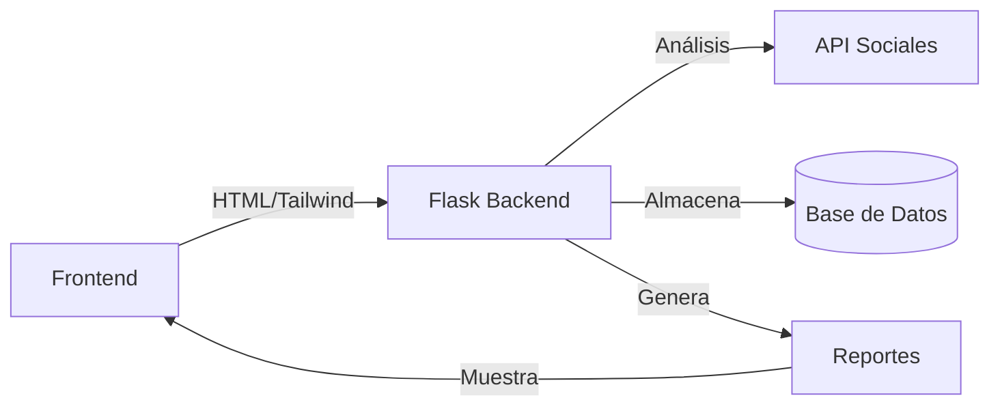
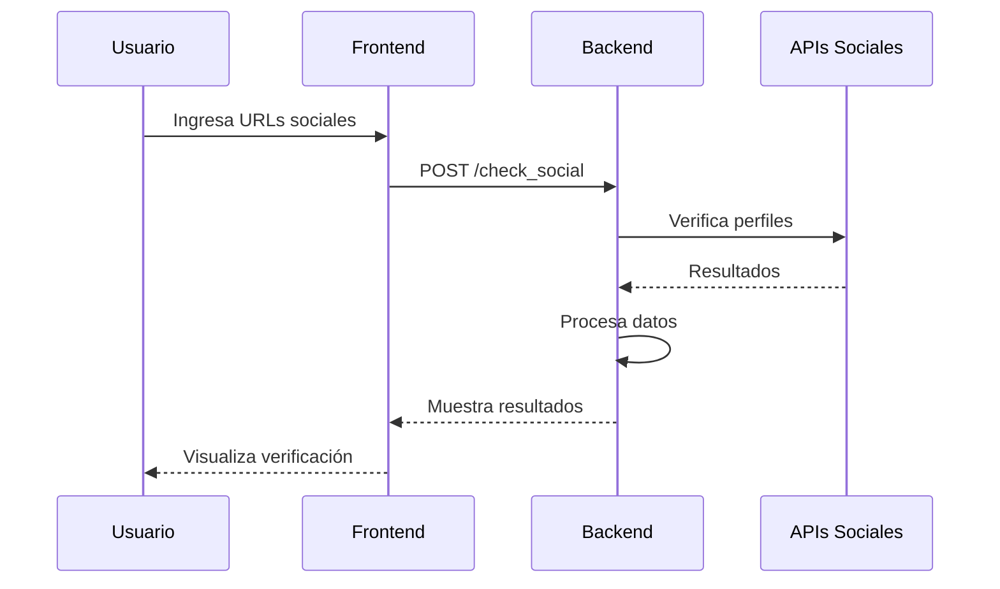

# InsightHub - Verificador de Perfiles Sociales 🚀

Este proyecto es una aplicación web que permite a los usuarios verificar la autenticidad de perfiles en diferentes redes sociales y generar reportes de análisis.

## 📋 Características Principales

- Verificación simultánea de 5 redes sociales principales
- Interfaz moderna y responsive basada en Tailwind CSS
- Generación de reportes detallados
- Análisis de engagement
- Diseño intuitivo estilo shadcn

## 🔍 Diagrama de Flujo del Sistema



## 🏗️ Arquitectura del Sistema



## 🚀 Cómo Ejecutar el Proyecto

### Requisitos Previos

- Python 3.8 o superior
- pip o poetry

### Instalación

1. **Clonar el repositorio:**
```bash
git clone <tu-repositorio>
cd elibertoelizondo
```

2. **Configurar el entorno virtual (elige uno):**

Con pip:
```bash
python -m venv venv
source venv/bin/activate  # En Linux/Mac
# o
.\venv\Scripts\activate  # En Windows
pip install -r requirements.txt
```

Con poetry:
```bash
poetry install
poetry shell
```

3. **Ejecutar la aplicación:**
```bash
python app.py
```

La aplicación estará disponible en `http://localhost:5000`

## 🛠️ Estructura del Proyecto

```
elibertoelizondo/
├── app.py                 # Aplicación principal Flask
├── templates/            # Plantillas HTML
│   ├── check_social.html  # Formulario de verificación
│   ├── report_template.html # Plantilla de reportes
│   └── ...               # Otras plantillas
├── static/              # Archivos estáticos
│   └── logo.png         # Logotipo
├── requirements.txt     # Dependencias (pip)
└── poetry.lock         # Dependencias (poetry)
```

## 📊 Flujo de Verificación de Perfiles



## 🔐 Variables de Entorno Requeridas

Crear un archivo `.env` en la raíz del proyecto con:

```
FLASK_SECRET_KEY=tu_clave_secreta
DEBUG=True  # Solo en desarrollo
```

## 📝 Uso

1. Accede a la aplicación en tu navegador
2. Ingresa las URLs de los perfiles sociales a verificar
3. Haz clic en "Verificar Perfiles"
4. Revisa los resultados de la verificación
5. Genera y descarga reportes si es necesario

## 💻 Desarrollo

### Configuración del Entorno de Desarrollo

```bash
# Clonar el repositorio
git clone <tu-repositorio>
cd elibertoelizondo

# Configurar el entorno de desarrollo
make setup-dev
```

### Comandos Útiles

```bash
# Ejecutar pruebas
make test

# Verificar estilo de código
make lint

# Formatear código
make format

# Limpiar archivos temporales
make clean

# Construir imagen Docker
make docker-build

# Ejecutar contenedor Docker
make docker-run
```

### Flujo de Trabajo para Desarrollo

1. Crear una nueva rama para tu característica
```bash
git checkout -b feature/nueva-caracteristica
```

2. Realizar cambios y asegurarse de que las pruebas pasen
```bash
make test
make lint
```

3. Formatear el código
```bash
make format
```

4. Commit y push de los cambios
```bash
git add .
git commit -m "feat: descripción del cambio"
git push origin feature/nueva-caracteristica
```

### Pre-commit Hooks

El proyecto utiliza pre-commit hooks para asegurar la calidad del código. Se ejecutarán automáticamente antes de cada commit y verificarán:

- Formato del código (Black)
- Linting (Flake8)
- Trailing whitespace
- EOF newlines
- YAML válido
- Sin archivos grandes
- Sin declaraciones de debug

### Estructura de Carpetas

```
insighthub/
├── app.py               # Aplicación principal
├── templates/           # Plantillas HTML
├── static/             # Archivos estáticos
├── tests/              # Pruebas unitarias
└── requirements.txt    # Dependencias
```

### Configuración de CI/CD

El proyecto está configurado para desplegar automáticamente en Koyeb cuando se hace push a la rama main. El pipeline incluye:

1. Ejecución de pruebas
2. Verificación de estilo de código
3. Construcción de imagen Docker
4. Despliegue en Koyeb

### Variables de Entorno para Desarrollo

Crear un archivo `.env` en la raíz del proyecto:

```env
FLASK_ENV=development
FLASK_DEBUG=1
SECRET_KEY=tu_clave_secreta_aqui
YOUTUBE_API_KEY=tu_api_key_aqui
GROQ_API_KEY=tu_api_key_aqui
```

## 📝 Convenciones de Código

- Seguimos PEP 8 para el estilo de código Python
- Utilizamos Type Hints para anotaciones de tipo
- Documentamos todas las funciones con docstrings
- Seguimos Conventional Commits para mensajes de commit

## 🔍 Monitoreo y Logs

- Los logs de la aplicación se encuentran en `/var/log/insighthub/`
- Métricas disponibles en el endpoint `/metrics`
- Healthcheck en `/health`

## 🚀 Mejoras Futuras

- [ ] Implementar caché para resultados de verificación
- [ ] Añadir más redes sociales
- [ ] Mejorar el análisis de sentimientos
- [ ] Implementar autenticación OAuth
- [ ] Añadir exportación de datos en más formatos
